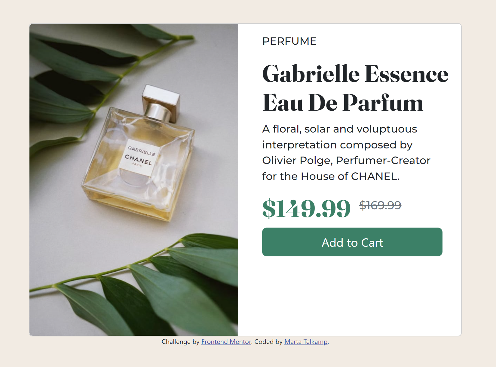

# Frontend Mentor - Product preview card component solution

This is a solution to the [Product preview card component challenge on Frontend Mentor](https://www.frontendmentor.io/challenges/product-preview-card-component-GO7UmttRfa). Frontend Mentor challenges help you improve your coding skills by building realistic projects. 

## Table of contents

- [Overview](#overview)
  - [The challenge](#the-challenge)
  - [Screenshot](#screenshot)
  - [Links](#links)
- [My process](#my-process)
  - [Built with](#built-with)
  - [What I learned](#what-i-learned)
  - [Continued development](#continued-development)
  - [Useful resources](#useful-resources)
- [Author](#author)
- [Acknowledgments](#acknowledgments)

## Overview

### The challenge

Users should be able to:

- View the optimal layout depending on their device's screen size
- See hover and focus states for interactive elements

### Screenshot

### Links

- Solution URL: [Code](https://github.com/idlehands1969/idlehands1969.github.io/blob/33479e12831769b0d8793d1b262eb1ccf9393edb/Product-Preview-Card/MyProductPreviewCard-files/index.html)
- Live Site URL: [Live Site](https://idlehands1969.github.io/Product-Preview-Card/MyProductPreviewCard-files/index.html)

## My process

### Built with

- HTML5
- CSS
- Bootstrap v5.0
- Mobile-first workflow

### What I learned
I am persistent! When I don't have a good outcome I keep coming at a challenge in different ways until I get the outcome I want.
Using Bootstrap often gets me over the hump in my projects.

### Continued development
I intend to continue working through these challenges to test myself and to seek knowledge and skills applicable to my new career choice.

## Author

- Website - [Marta Telkamp](https://www.iknittheweb.com)
- Frontend Mentor - [@idlehands1969](https://www.frontendmentor.io/profile/idlehands1969)
