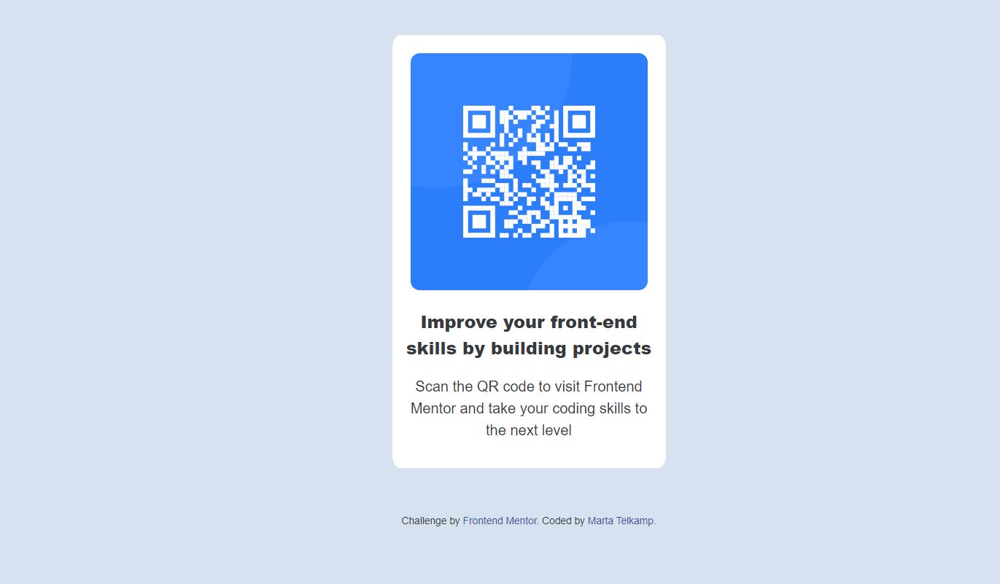

# Frontend Mentor - QR code component solution

This is a solution to the [QR code component challenge on Frontend Mentor](https://www.frontendmentor.io/challenges/qr-code-component-iux_sIO_H). Frontend Mentor challenges help you improve your coding skills by building realistic projects. 

## Table of contents

- [Overview](#overview)
  - [Screenshot](#screenshot)
  - [Links](#links)
- [My process](#my-process)
  - [Built with](#built-with)
  - [What I learned](#what-i-learned)
  - [Continued development](#continued-development)
  - [Useful resources](#useful-resources)
- [Author](#author)
- [Acknowledgments](#acknowledgments)

## Overview

### Screenshot

### Links

- Solution URL: [Code](https://github.com/idlehands1969/idlehands1969.github.io/blob/5edaea5f3c3726004d5bd77e841dc349721a04a7/QR%20Code%20Component/MyQRCodeComponent-files/index.html)
- Live Site URL: [Live](https://idlehands1969.github.io/QR%20Code%20Component/MyQRCodeComponent-files/index.html)

## My process

### Built with

- Semantic HTML5 markup
- CSS custom properties
- Flexbox
- Mobile-first workflow

### What I learned

This was pretty easy for me. If anyone can look at my code and tell me what I could have done better, I would appreciate it.

## Author

- Website - [Marta Telkamp](https://www.iknittheweb.com)
- Frontend Mentor - [@idlehands1969](https://www.frontendmentor.io/profile/idlehands1969)
- Twitter - [@Idle_Hands_1969](https://www.twitter.com/Idle_Hands_1969)

## Acknowledgments
I would like to thank [Frontend Mentor](https://www.frontendmentor.io/) for providing the opportunity to practice skills with great projects.