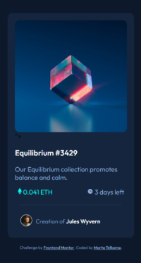

# Frontend Mentor - NFT preview card component solution

This is a solution to the [NFT preview card component challenge on Frontend Mentor](https://www.frontendmentor.io/challenges/nft-preview-card-component-SbdUL_w0U).  

## Table of contents

- [Overview](#overview)
  - [The challenge](#the-challenge)
  - [Screenshot](#screenshot)
  - [Links](#links)
- [My process](#my-process)
  - [Built with](#built-with)
  - [What I learned](#what-i-learned)
  - [Continued development](#continued-development)
  - [Useful resources](#useful-resources)
- [Author](#author)

## Overview

### The challenge

Users should be able to:

- View the optimal layout depending on their device's screen size
- See hover states for interactive elements

### Screenshot

### Links

- [Solution](https://github.com/idlehands1969/idlehands1969.github.io/blob/768cfba2cfe37d0b3e5452b3cc97acd1c9874058/nft-preview-card-component-main/index.html)
- [Live](https://idlehands1969.github.io/nft-preview-card-component-main/My%20NFT%20Preview%20Card%20Component%20files/index.html)

## My process

### Built with

- Semantic HTML5 markup
- CSS custom properties
- Flexbox
- Mobile-first workflow

### What I learned

I'm not sure why I struggle with Flexbox so much. I completely understand it, but EVERY.SINGLE.TIME. it goes awry somewhere and it takes me hours to fix it. Gah! I hope that with experience I'll get better at finding my mistakes...

### Continued development

I need to continue working with Flexbox to develop better instincts with it. I also want to work on Grid, but it doesn't seem as responsive as flexbox and I seem to be able to get things done with Flexbox. However, I do want to have all the tools in my toolbox that I can master. (Does anyone truly master these things? I feel like there is always more to learn.)

### Useful resources

- Kevin Powell's Flexbox [YouTube Playlist](https://www.youtube.com/watch?v=hwbqquXww-U) - This helped me so much in my understanding of Flexbox. I really liked these videos and I will continue watching his videos for other aspects of the challenges.

## Author

- Website - [Marta Telkamp](https://iknittheweb.com)
- Frontend Mentor - [@idlehands1969](https://www.frontendmentor.io/profile/idlehands1969)
- Twitter - [@Idle_Hands_1969](https://www.twitter.com/Idle_Hands_1969)

